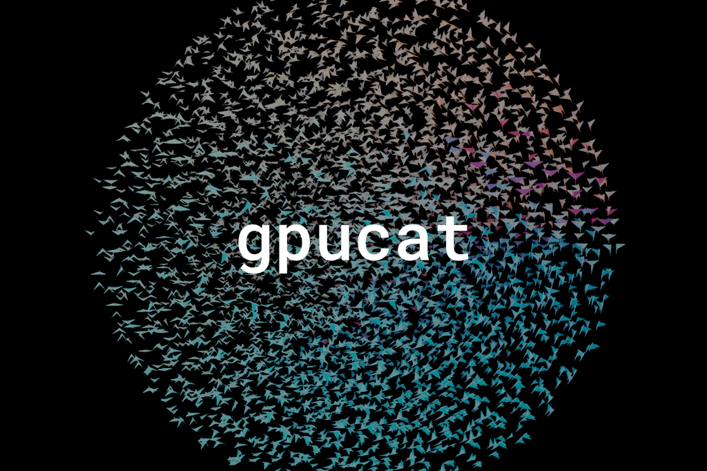

```sh
> npm install isaac-mason/gpucat
```

> gpucat is being built in public. installation is via the github repo instead of npm for now.

# gpucat

gpucat is a minimal typescript-first WebGPU renderer.

It is a marriage of ideas in three.js and typegpu. It has a node-based shading language similar to [three.js TSL](https://github.com/mrdoob/three.js/wiki/Three.js-Shading-Language), and has the typescript-first, WebGPU-native feel of [typegpu](https://typegpu.com).

You get a declarative API for GPU resources (buffers, uniforms, textures, materials), a type-safe node-based shading language that mirrors WGSL grammar and compiles to WGSL, and gpucat handles the generation of pipelines, layouts, bind groups, and resource lifecycles for you.

Most WebGPU libraries either hide the GPU behind a scene abstraction or hand you raw WGSL strings. gpucat sits in between. You compose shaders as typed typescript expressions, so refactors and autocomplete work, but nothing stops you dropping down to the renderer, pipeline, and buffer level when you need to.

## Contents

- [Getting Started](#getting-started) · [Core Concepts](#core-concepts)
- Language: [Constants](#constants-and-constructors) · [Operators](#operators) · [Variables](#variables) · [Control Flow](#control-flow) · [Method Chaining](#method-chaining)
- Building shaders: [Building Blocks](#building-blocks) · [Varyings](#varyings) · [Textures](#textures-and-samplers) · [Atomics](#atomics) · [Builtins](#builtins) · [Context Uniforms](#context-uniforms)
- Resources & scene: [Geometry](#geometry) · [Materials](#materials) · [Uniforms and Data](#uniforms-and-data) · [Scene and Objects](#scene-and-objects)
- Rendering: [Compute](#compute) · [The Renderer](#the-renderer) · [Render Pipeline](#render-pipeline) · [Controls and the Inspector](#controls-and-the-inspector)
- [Compiling to WGSL](#compiling-to-wgsl) · [WGSL to gpucat](#wgsl-to-gpucat) · [API Reference](#api-reference)

## Getting Started

A minimal spinning cube. Renderer setup, a node-based material, and a `requestAnimationFrame` loop:

```ts
import {
    attribute,
    cameraProjectionMatrix,
    cameraViewMatrix,
    createBoxGeometry,
    d,
    f32,
    Material,
    Mesh,
    modelNormalMatrix,
    modelWorldMatrix,
    mul,
    normalize,
    pass,
    PerspectiveCamera,
    renderOutput,
    RenderPipeline,
    Scene,
    varying,
    vec3,
    vec4,
    WebGPURenderer,
} from 'gpucat';
import { quat } from 'mathcat';

// renderer
const renderer = new WebGPURenderer({ antialias: true });
await renderer.init();
document.body.appendChild(renderer.domElement);
renderer.setPixelRatio(devicePixelRatio);
renderer.setSize(window.innerWidth, window.innerHeight);

// scene + camera
const scene = new Scene();
const camera = new PerspectiveCamera(Math.PI / 4, window.innerWidth / window.innerHeight, 0.1, 100);
camera.position[2] = 4;
scene.add(camera);

// vertex: project the cube into clip space, varying the world-space normal
const position = attribute('position', d.vec3f);
const normal = attribute('normal', d.vec3f);
const worldPosition = mul(modelWorldMatrix, vec4(position, f32(1)));
const clipPosition = mul(cameraProjectionMatrix, mul(cameraViewMatrix, worldPosition));
const vWorldNormal = varying(normalize(mul(modelNormalMatrix, normal)), 'vNormal');

// fragment: simple Lambert shading
const lightDirection = vec3(0.6, 1.0, 0.8).normalize();
const diffuse = vWorldNormal.dot(lightDirection).max(f32(0));
const lighting = f32(0.15).add(diffuse);
const litColor = vec3(0.4, 0.7, 1.0).mul(lighting);

// mesh
const material = new Material({ vertex: clipPosition, fragment: vec4(litColor, f32(1)) });
const mesh = new Mesh(createBoxGeometry(1, 1, 1), material);
scene.add(mesh);

// render pipeline
const scenePass = pass(scene, camera);
const renderPipeline = new RenderPipeline(renderer, renderOutput(scenePass.getTextureNode()));

// frame loop
let angle = 0;
let prevTime = performance.now() / 1000;

function frame() {
    const now = performance.now() / 1000;
    const dt = now - prevTime;
    prevTime = now;

    angle += dt * 0.8;
    quat.fromEuler(mesh.quaternion, [angle * 0.6, angle, 0, 'xyz']);
    mesh.updateWorldMatrix();
    scene.updateWorldMatrix();
    camera.updateViewMatrix();

    renderPipeline.render();
    requestAnimationFrame(frame);
}

requestAnimationFrame(frame);
```

A few things to notice:

- The material is just two nodes: `vertex` (a clip-space position) and `fragment` (a `vec4f` color). You build them by composing smaller nodes, and gpucat compiles the resulting graph to WGSL.
- You own the frame loop. gpucat never starts its own `requestAnimationFrame` and never reads a wall clock. You call `render()` (and `compute()`) when you want a frame, and you drive time yourself via plain uniforms, so it stays composable with your own update loop.
- Resources are declarative. A `Mesh` is geometry plus material, a `RenderPipeline` is a renderer plus an output node. gpucat derives the pipeline, layouts, and bind groups from what you reference.

## Core Concepts

### Nodes and the graph

Everything in a shader is a node. `attribute`, `uniform`, `add`, `mul`, `texture`, `vec3`, and the rest each create a node, and nodes compose into a graph:

```ts
const position = attribute('position', d.vec3f);             // a vertex input
const world = mul(modelWorldMatrix, vec4(position, f32(1)));  // node math
const clip = mul(cameraProjectionMatrix, mul(cameraViewMatrix, world));
```

Nothing has run on the GPU yet. You have built an expression graph. When you hand a node to a `Material` (or call `compile()` directly), gpucat walks the graph, eliminates common subexpressions, and emits WGSL.

### Types: the `d` namespace

Types come from the `d` namespace: `d.vec3f`, `d.f32`, `d.mat4x4f`, `d.array(d.u32)`, `d.struct(...)`. These are WGSL type descriptors. They describe the data on the GPU and give the typescript compiler enough to type-check your shader.

There is a split worth internalising early: `d.f32` is the *type*, `f32(1)` is a *node* of that type. The same split you see between a value and its type. You annotate with `d.f32`, you build a node with `f32(1)`.

## Constants and constructors

Scalar and vector constructors turn javascript numbers into typed constant nodes. `f32(0.5)`, `vec3(1, 0, 0)`, `mat4(...)`. The `vec*` constructors accept a mix of scalars and smaller vectors, so `vec4(rgb, 1)` works.

<table><tr>
<td><a href="./api.md#f16"><code>f16</code></a></td><td><a href="./api.md#f32"><code>f32</code></a></td><td><a href="./api.md#i32"><code>i32</code></a></td><td><a href="./api.md#u32"><code>u32</code></a></td><td><a href="./api.md#bool"><code>bool</code></a></td><td><a href="./api.md#rgb"><code>rgb</code></a></td>
</tr><tr>
<td><a href="./api.md#vec2"><code>vec2</code></a></td><td><a href="./api.md#vec2f"><code>vec2f</code></a></td><td><a href="./api.md#vec2h"><code>vec2h</code></a></td><td><a href="./api.md#vec2i"><code>vec2i</code></a></td><td><a href="./api.md#vec2u"><code>vec2u</code></a></td><td><a href="./api.md#vec2b"><code>vec2b</code></a></td>
</tr><tr>
<td><a href="./api.md#vec3"><code>vec3</code></a></td><td><a href="./api.md#vec3f"><code>vec3f</code></a></td><td><a href="./api.md#vec3h"><code>vec3h</code></a></td><td><a href="./api.md#vec3i"><code>vec3i</code></a></td><td><a href="./api.md#vec3u"><code>vec3u</code></a></td><td><a href="./api.md#vec3b"><code>vec3b</code></a></td>
</tr><tr>
<td><a href="./api.md#vec4"><code>vec4</code></a></td><td><a href="./api.md#vec4f"><code>vec4f</code></a></td><td><a href="./api.md#vec4h"><code>vec4h</code></a></td><td><a href="./api.md#vec4i"><code>vec4i</code></a></td><td><a href="./api.md#vec4u"><code>vec4u</code></a></td><td><a href="./api.md#vec4b"><code>vec4b</code></a></td>
</tr><tr>
<td><a href="./api.md#mat3"><code>mat3</code></a></td><td><a href="./api.md#mat4"><code>mat4</code></a></td><td><a href="./api.md#mat2x2f"><code>mat2x2f</code></a></td><td><a href="./api.md#mat2x3f"><code>mat2x3f</code></a></td><td><a href="./api.md#mat2x4f"><code>mat2x4f</code></a></td><td><a href="./api.md#mat3x2f"><code>mat3x2f</code></a></td>
</tr><tr>
<td><a href="./api.md#mat3x3f"><code>mat3x3f</code></a></td><td><a href="./api.md#mat3x4f"><code>mat3x4f</code></a></td><td><a href="./api.md#mat4x2f"><code>mat4x2f</code></a></td><td><a href="./api.md#mat4x3f"><code>mat4x3f</code></a></td><td><a href="./api.md#mat4x4f"><code>mat4x4f</code></a></td><td><a href="./api.md#mat2x2h"><code>mat2x2h</code></a></td>
</tr><tr>
<td><a href="./api.md#mat2x3h"><code>mat2x3h</code></a></td><td><a href="./api.md#mat2x4h"><code>mat2x4h</code></a></td><td><a href="./api.md#mat3x2h"><code>mat3x2h</code></a></td><td><a href="./api.md#mat3x3h"><code>mat3x3h</code></a></td><td><a href="./api.md#mat3x4h"><code>mat3x4h</code></a></td><td><a href="./api.md#mat4x2h"><code>mat4x2h</code></a></td>
</tr><tr>
<td><a href="./api.md#mat4x3h"><code>mat4x3h</code></a></td><td><a href="./api.md#mat4x4h"><code>mat4x4h</code></a></td><td></td><td></td><td></td><td></td>
</tr></table>


## Operators

Math and operators exist as free functions, and (see [method chaining](#method-chaining)) as methods. `add(a, b)` is `a.add(b)`. They are type-directed: `mul(mat4, vec4)` is a matrix-vector multiply, `mul(vec3, vec3)` is component-wise.

```ts
const lit = vec3(0.4, 0.7, 1.0).mul(f32(0.15).add(diffuse));
```

<table><tr>
<td><a href="./api.md#abs"><code>abs</code></a></td><td><a href="./api.md#add"><code>add</code></a></td><td><a href="./api.md#sub"><code>sub</code></a></td><td><a href="./api.md#mul"><code>mul</code></a></td><td><a href="./api.md#div"><code>div</code></a></td><td><a href="./api.md#mod"><code>mod</code></a></td>
</tr><tr>
<td><a href="./api.md#min"><code>min</code></a></td><td><a href="./api.md#max"><code>max</code></a></td><td><a href="./api.md#clamp"><code>clamp</code></a></td><td><a href="./api.md#mix"><code>mix</code></a></td><td><a href="./api.md#step"><code>step</code></a></td><td><a href="./api.md#smoothstep"><code>smoothstep</code></a></td>
</tr><tr>
<td><a href="./api.md#ceil"><code>ceil</code></a></td><td><a href="./api.md#floor"><code>floor</code></a></td><td><a href="./api.md#fract"><code>fract</code></a></td><td><a href="./api.md#sqrt"><code>sqrt</code></a></td><td><a href="./api.md#inversesqrt"><code>inverseSqrt</code></a></td><td><a href="./api.md#pow"><code>pow</code></a></td>
</tr><tr>
<td><a href="./api.md#exp"><code>exp</code></a></td><td><a href="./api.md#exp2"><code>exp2</code></a></td><td><a href="./api.md#log"><code>log</code></a></td><td><a href="./api.md#log2"><code>log2</code></a></td><td><a href="./api.md#tan"><code>tan</code></a></td><td><a href="./api.md#atan"><code>atan</code></a></td>
</tr><tr>
<td><a href="./api.md#atan2"><code>atan2</code></a></td><td><a href="./api.md#asin"><code>asin</code></a></td><td><a href="./api.md#acos"><code>acos</code></a></td><td><a href="./api.md#length"><code>length</code></a></td><td><a href="./api.md#normalize"><code>normalize</code></a></td><td><a href="./api.md#dot"><code>dot</code></a></td>
</tr><tr>
<td><a href="./api.md#cross"><code>cross</code></a></td><td><a href="./api.md#pack2x16float"><code>pack2x16float</code></a></td><td><a href="./api.md#unpack2x16float"><code>unpack2x16float</code></a></td><td><a href="./api.md#pack2x16snorm"><code>pack2x16snorm</code></a></td><td><a href="./api.md#unpack2x16snorm"><code>unpack2x16snorm</code></a></td><td><a href="./api.md#pack2x16unorm"><code>pack2x16unorm</code></a></td>
</tr><tr>
<td><a href="./api.md#unpack2x16unorm"><code>unpack2x16unorm</code></a></td><td><a href="./api.md#pack4x8snorm"><code>pack4x8snorm</code></a></td><td><a href="./api.md#unpack4x8snorm"><code>unpack4x8snorm</code></a></td><td><a href="./api.md#pack4x8unorm"><code>pack4x8unorm</code></a></td><td><a href="./api.md#unpack4x8unorm"><code>unpack4x8unorm</code></a></td><td><a href="./api.md#bitcastf32"><code>bitcastF32</code></a></td>
</tr><tr>
<td><a href="./api.md#bitcastu32"><code>bitcastU32</code></a></td><td><a href="./api.md#bitcasti32"><code>bitcastI32</code></a></td><td><a href="./api.md#sign"><code>sign</code></a></td><td><a href="./api.md#sin"><code>sin</code></a></td><td><a href="./api.md#cos"><code>cos</code></a></td><td><a href="./api.md#transpose"><code>transpose</code></a></td>
</tr><tr>
<td><a href="./api.md#countonebits"><code>countOneBits</code></a></td><td><a href="./api.md#counttrailingzeros"><code>countTrailingZeros</code></a></td><td><a href="./api.md#countleadingzeros"><code>countLeadingZeros</code></a></td><td><a href="./api.md#reversebits"><code>reverseBits</code></a></td><td><a href="./api.md#firstleadingbit"><code>firstLeadingBit</code></a></td><td><a href="./api.md#firsttrailingbit"><code>firstTrailingBit</code></a></td>
</tr><tr>
<td><a href="./api.md#dpdx"><code>dpdx</code></a></td><td><a href="./api.md#dpdy"><code>dpdy</code></a></td><td><a href="./api.md#fwidth"><code>fwidth</code></a></td><td><a href="./api.md#dpdxcoarse"><code>dpdxCoarse</code></a></td><td><a href="./api.md#dpdycoarse"><code>dpdyCoarse</code></a></td><td><a href="./api.md#fwidthcoarse"><code>fwidthCoarse</code></a></td>
</tr><tr>
<td><a href="./api.md#dpdxfine"><code>dpdxFine</code></a></td><td><a href="./api.md#dpdyfine"><code>dpdyFine</code></a></td><td><a href="./api.md#fwidthfine"><code>fwidthFine</code></a></td><td></td><td></td><td></td>
</tr></table>


### Comparison

<table><tr>
<td><a href="./api.md#greaterthan"><code>greaterThan</code></a></td><td><a href="./api.md#lessthan"><code>lessThan</code></a></td><td><a href="./api.md#greaterthanequal"><code>greaterThanEqual</code></a></td><td><a href="./api.md#lessthanequal"><code>lessThanEqual</code></a></td><td><a href="./api.md#equal"><code>equal</code></a></td><td><a href="./api.md#notequal"><code>notEqual</code></a></td>
</tr><tr>
<td><a href="./api.md#or"><code>or</code></a></td><td><a href="./api.md#and"><code>and</code></a></td><td></td><td></td><td></td><td></td>
</tr></table>


### Bitwise

<table><tr>
<td><a href="./api.md#bitwiseand"><code>bitwiseAnd</code></a></td><td><a href="./api.md#bitwiseor"><code>bitwiseOr</code></a></td><td><a href="./api.md#bitwisexor"><code>bitwiseXor</code></a></td><td><a href="./api.md#shiftleft"><code>shiftLeft</code></a></td><td><a href="./api.md#shiftright"><code>shiftRight</code></a></td>
</tr></table>


## Variables

By default a reused expression is hoisted into a `let` automatically. When you want explicit, mutable WGSL variables (for accumulation, or to assign in a loop), use `Var`. The name comes first so it reads like a declaration:

```ts
const sum = Var('sum', f32(0));
Loop(8, ({ i }) => sum.assign(sum.add(i.toF32())));
```

`Let` is the immutable form. `PrivateVar` and `WorkgroupVar` declare module-scope storage for compute.

<table><tr>
<td><a href="./api.md#var"><code>Var</code></a></td><td><a href="./api.md#const"><code>Const</code></a></td><td><a href="./api.md#let"><code>Let</code></a></td><td><a href="./api.md#privatevar"><code>PrivateVar</code></a></td><td><a href="./api.md#workgroupvar"><code>WorkgroupVar</code></a></td>
</tr></table>


## Control Flow

`If` / `Loop` / `For` / `While` mirror WGSL control flow and take callbacks for their bodies. `select(a, b, cond)` and `cond(c, a, b)` are the expression-level ternary.

```ts
If(x.greaterThan(f32(0)), () => {
    result.assign(x);
}).Else(() => {
    result.assign(x.negate());
});
```

<table><tr>
<td><a href="./api.md#if"><code>If</code></a></td><td><a href="./api.md#loop"><code>Loop</code></a></td><td><a href="./api.md#for"><code>For</code></a></td><td><a href="./api.md#while"><code>While</code></a></td><td><a href="./api.md#break"><code>Break</code></a></td><td><a href="./api.md#continue"><code>Continue</code></a></td>
</tr><tr>
<td><a href="./api.md#return"><code>Return</code></a></td><td><a href="./api.md#discard"><code>Discard</code></a></td><td><a href="./api.md#workgroupbarrier"><code>workgroupBarrier</code></a></td><td><a href="./api.md#storagebarrier"><code>storageBarrier</code></a></td><td><a href="./api.md#texturebarrier"><code>textureBarrier</code></a></td><td><a href="./api.md#cond"><code>cond</code></a></td>
</tr><tr>
<td><a href="./api.md#select"><code>select</code></a></td><td></td><td></td><td></td><td></td><td></td>
</tr></table>


## Method Chaining

Most operators exist as both a free function and a method on `Node`, so `mul(a, b)` and `a.mul(b)` are the same thing. Swizzles (`.xyz`, `.xy`), conversions (`.toF32()`, `.toVar()`), and sampling all read naturally as chains:

```ts
const luma = color.rgb.dot(vec3(0.299, 0.587, 0.114)).toVar('luma');
```

The full `Node` method surface is in the [API reference](./api.md#node-methods).

## Building Blocks

These pull data into a shader and build its larger pieces: vertex `attribute`s, `uniform`s, `storage` buffers, `texture`s, `struct`s, sub-functions with `Fn`, raw WGSL with `wgsl` / `wgslFn`, and compute kernels with `compute`.

```ts
const time = uniform('time', d.f32);
const positions = storage('positions', d.array(d.vec3f), 'read');
```

<table><tr>
<td><a href="./api.md#attribute"><code>attribute</code></a></td><td><a href="./api.md#attributeoptions"><code>AttributeOptions</code></a></td><td><a href="./api.md#builtin"><code>builtin</code></a></td><td><a href="./api.md#index"><code>index</code></a></td><td><a href="./api.md#field"><code>field</code></a></td><td><a href="./api.md#fields"><code>fields</code></a></td>
</tr><tr>
<td><a href="./api.md#uniform"><code>uniform</code></a></td><td><a href="./api.md#storage"><code>storage</code></a></td><td><a href="./api.md#array"><code>array</code></a></td><td><a href="./api.md#texture"><code>texture</code></a></td><td><a href="./api.md#varying"><code>varying</code></a></td><td><a href="./api.md#struct"><code>struct</code></a></td>
</tr><tr>
<td><a href="./api.md#wgsl"><code>wgsl</code></a></td><td><a href="./api.md#wgslfn"><code>wgslFn</code></a></td><td><a href="./api.md#fn"><code>Fn</code></a></td><td><a href="./api.md#mrt"><code>mrt</code></a></td><td><a href="./api.md#compute"><code>compute</code></a></td><td></td>
</tr></table>


## Varyings

A shader runs in two stages. The vertex stage runs once per vertex; the fragment stage runs once per pixel. A varying is the bridge between them: a value computed per vertex, interpolated across the triangle, then read per fragment.

`varying(expr)` marks `expr` as a vertex-stage computation whose result crosses to the fragment stage. You do not split your code into two shaders by hand. You write the expression once, wrap it, and gpucat builds it into the vertex stage and wires up the interpolated output and input for you.

```ts
// computed per vertex, interpolated, then read in the fragment stage
const vNormal = varying(normalize(mul(modelNormalMatrix, normal)), 'vNormal');
const lighting = vNormal.dot(lightDir).max(f32(0));
```

This matters because a node referenced from the fragment side is otherwise computed per fragment. A transformed normal, or a uv, belongs per vertex plus interpolation, which is both cheaper and the right behaviour for smoothly varying data.

### Interpolation

A varying is perspective-correct by default (the WGSL default for floats). `setInterpolation(type, sampling?)` sets the WGSL `@interpolate` qualifier:

- `type`: `'perspective'` (default), `'linear'` (non-perspective-correct), or `'flat'` (no interpolation, takes the provoking vertex's value). `'flat'` is required for integer varyings.
- `sampling` (optional, only with perspective/linear): `'center'` (default), `'centroid'`, `'sample'`, or `'either'`, for MSAA edge cases.

```ts
// integers must be flat; also use flat for per-primitive ids you do not want blended
const vMatId = varying(materialId).setInterpolation('flat');
```

## Textures and Samplers

Textures and samplers are first-class nodes, mirroring WGSL's separate texture/sampler model. The high-level `texture()` node auto-creates a sampler and samples at the interpolated UV; the free functions (`textureSample`, `textureLoad`, and the rest) give you WGSL-level control.

```ts
const albedo = texture(myTexture);            // samples at uv()
const exact = textureLoad(myTexture, coords); // no sampler
```

<table><tr>
<td><a href="./api.md#sampler"><code>sampler</code></a></td><td><a href="./api.md#comparisonsampler"><code>comparisonSampler</code></a></td><td><a href="./api.md#cubetexture"><code>cubeTexture</code></a></td><td><a href="./api.md#depthtexture"><code>depthTexture</code></a></td><td><a href="./api.md#arraytexture"><code>arrayTexture</code></a></td><td><a href="./api.md#texturebinding"><code>textureBinding</code></a></td>
</tr><tr>
<td><a href="./api.md#texturesample"><code>textureSample</code></a></td><td><a href="./api.md#texturesamplelevel"><code>textureSampleLevel</code></a></td><td><a href="./api.md#texturesamplebias"><code>textureSampleBias</code></a></td><td><a href="./api.md#texturesamplegrad"><code>textureSampleGrad</code></a></td><td><a href="./api.md#texturesamplecompare"><code>textureSampleCompare</code></a></td><td><a href="./api.md#texturesamplecomparelevel"><code>textureSampleCompareLevel</code></a></td>
</tr><tr>
<td><a href="./api.md#textureload"><code>textureLoad</code></a></td><td><a href="./api.md#texturestore"><code>textureStore</code></a></td><td><a href="./api.md#texturedimensions"><code>textureDimensions</code></a></td><td><a href="./api.md#texturenumlevels"><code>textureNumLevels</code></a></td><td><a href="./api.md#texturenumlayers"><code>textureNumLayers</code></a></td><td><a href="./api.md#texturegather"><code>textureGather</code></a></td>
</tr><tr>
<td><a href="./api.md#texturegathercompare"><code>textureGatherCompare</code></a></td><td></td><td></td><td></td><td></td><td></td>
</tr></table>


### Creating texture resources

The `texture()` node takes a texture resource. Create one from an image, or from raw pixels:

```ts
const tex = new Texture(image);                          // HTMLImageElement, ImageBitmap, canvas
const data = new DataTexture(pixels, 256, 256, { format: 'rgba8unorm' });
```

`CubeTexture`, `ArrayTexture`, and `CanvasTexture` cover the other shapes, and sampler settings (`wrapS`, `magFilter`, `anisotropy`, and so on) live on the texture. A pass output is also a texture, which is what makes post-processing just node wiring. See [`Texture`](./api.md#texture).

## Atomics

Atomic operations on `atomic<i32>` / `atomic<u32>` storage, for compute.

<table><tr>
<td><a href="./api.md#atomicadd"><code>atomicAdd</code></a></td><td><a href="./api.md#atomicstore"><code>atomicStore</code></a></td><td><a href="./api.md#atomicload"><code>atomicLoad</code></a></td><td><a href="./api.md#atomicsub"><code>atomicSub</code></a></td><td><a href="./api.md#atomicmax"><code>atomicMax</code></a></td><td><a href="./api.md#atomicmin"><code>atomicMin</code></a></td>
</tr><tr>
<td><a href="./api.md#atomicand"><code>atomicAnd</code></a></td><td><a href="./api.md#atomicor"><code>atomicOr</code></a></td><td><a href="./api.md#atomicxor"><code>atomicXor</code></a></td><td><a href="./api.md#atomicexchange"><code>atomicExchange</code></a></td><td><a href="./api.md#atomiccompareexchangeweak"><code>atomicCompareExchangeWeak</code></a></td><td></td>
</tr></table>


## Builtins

WGSL builtin inputs: invocation and vertex indices, compute ids, and so on.

<table><tr>
<td><a href="./api.md#instanceindex"><code>instanceIndex</code></a></td><td><a href="./api.md#vertexindex"><code>vertexIndex</code></a></td><td><a href="./api.md#globalid"><code>globalId</code></a></td><td><a href="./api.md#localid"><code>localId</code></a></td><td><a href="./api.md#localindex"><code>localIndex</code></a></td><td><a href="./api.md#workgroupid"><code>workgroupId</code></a></td>
</tr><tr>
<td><a href="./api.md#numworkgroups"><code>numWorkgroups</code></a></td><td></td><td></td><td></td><td></td><td></td>
</tr></table>


## Context Uniforms

gpucat provides the common per-frame and per-object uniforms as ready-made nodes, so you do not have to wire them up yourself: camera matrices and the model matrices.

<table><tr>
<td><a href="./api.md#cameraprojectionmatrix"><code>cameraProjectionMatrix</code></a></td><td><a href="./api.md#cameraviewmatrix"><code>cameraViewMatrix</code></a></td><td><a href="./api.md#cameraposition"><code>cameraPosition</code></a></td><td><a href="./api.md#cameranear"><code>cameraNear</code></a></td><td><a href="./api.md#camerafar"><code>cameraFar</code></a></td>
</tr></table>

<table><tr>
<td><a href="./api.md#modelworldmatrix"><code>modelWorldMatrix</code></a></td><td><a href="./api.md#modelnormalmatrix"><code>modelNormalMatrix</code></a></td>
</tr></table>

<table><tr>
<td><a href="./api.md#fragcoord"><code>fragCoord</code></a></td><td><a href="./api.md#screencoordinate"><code>screenCoordinate</code></a></td><td><a href="./api.md#screensize"><code>screenSize</code></a></td><td><a href="./api.md#screenuv"><code>screenUV</code></a></td>
</tr></table>


## Geometry

A `Geometry` is a set of named vertex buffers plus an optional index buffer. The buffer names line up with the `attribute('name', type)` nodes in your vertex shader.

```ts
const geom = new Geometry();
geom.setBuffer('position', createVertexBuffer(d.vec3f, positions));
geom.setBuffer('normal', createVertexBuffer(d.vec3f, normals));
geom.index = createIndexBuffer(indices);   // a Uint16Array or Uint32Array
```

For common shapes, the `create*Geometry` helpers build the position, normal, and uv buffers and an index for you. See [`Geometry`](./api.md#geometry) and the helpers in [api.md](./api.md#geometry).

## Materials

A `Material` is the shaders plus the pipeline state. The `vertex` slot is a clip-space position, `fragment` is a `vec4f` color (or an `mrt(...)` node for multiple targets), and `depth` optionally overrides the written depth.

```ts
const material = new Material({
    vertex: clipPos,
    fragment: litColor,
    transparent: true,   // alpha blending; draws after opaque, depthWrite off by default
    cullMode: 'back',    // 'back' (default), 'front', or 'none'
});
```

The remaining options are the usual pipeline state: `depthTest`, `depthWrite`, `depthCompare`, `blend`, `alphaToCoverage`, and the depth-bias trio. After changing which node feeds a slot, set `material.needsUpdate = true` to force a recompile. See [`Material`](./api.md#material).

## Uniforms and Data

Shader nodes pull from CPU data through uniforms and buffers, and you update that data from your own loop.

A `Uniform` owns a value; `uniform(...)` turns it into a node. Set `.value` and the change uploads on the next frame:

```ts
const uColor = new Uniform(d.vec3f, [1, 0, 0]);
const color = uniform(uColor);   // a node to use in a shader
uColor.value = [0, 1, 0];        // update anytime; uploaded next frame
```

You can also resolve a uniform by name from a material, handy when one shader graph is shared across meshes with different values:

```ts
const color = uniform('color', d.vec3f);                          // in the shader
material.uniforms.set('color', new Uniform(d.vec3f, [1, 0, 0]));  // per material
```

A uniform's **group** sets both its WGSL `@group` and how often it uploads: `objectGroup` (default, per draw call), `renderGroup` (per `render()` call), `frameGroup` (once per frame). The built-in camera and model uniforms already sit in the right groups.

Buffers wrap a typed array as a `GpuBuffer`: `createVertexBuffer`, `createStorageBuffer`, `createUniformBuffer`, `createIndexBuffer`, `createIndirectBuffer`. To change the data, edit the array and mark it dirty:

```ts
const buf = createStorageBuffer(d.array(d.vec4f), data);
buf.array[0] = 1.5;
buf.needsUpdate = true;     // re-upload the whole buffer
buf.addUpdateRange(0, 4);   // or upload just 4 components from offset 0
```

See [`Uniform`](./api.md#uniform-2), [`createStorageBuffer`](./api.md#createstoragebuffer), and [`GpuBuffer`](./api.md#gpubuffer).

## Scene and Objects

A `Scene` holds a tree of `Object3D`s. Each object has a `position`, `quaternion`, and `scale`; you call `updateWorldMatrix()` to fold them into its world matrix. A `Mesh` is geometry plus material.

```ts
const scene = new Scene();

const mesh = new Mesh(geom, material);
mesh.position[1] = 2;
scene.add(mesh);

const camera = new PerspectiveCamera(Math.PI / 4, width / height, 0.1, 100);
camera.position[2] = 5;
scene.add(camera);
```

For **instancing**, set `mesh.count` and read `instanceIndex` in the shader to vary each instance (this is how the particle example draws thousands of quads from one mesh).

Cameras carry the projection: `PerspectiveCamera(fov, aspect, near, far)` or `OrthographicCamera(...)`. After moving things, update the matrices before rendering (see the frame loop below). See [`Scene`](./api.md#scene), [`Object3D`](./api.md#object3d), [`Mesh`](./api.md#mesh), [`PerspectiveCamera`](./api.md#perspectivecamera).

## Compute

Compute shaders use the same node API. You declare storage buffers, write a kernel with `Fn(...).compute(...)`, and dispatch it through the renderer before you render. Index into a buffer with `index(buf, i)` and write with `.assign(...)`.

```ts
// a storage buffer the kernel reads and writes
const positions = storage(createStorageBuffer(d.array(d.vec4f), data), 'read_write');

const sim = Fn(() => {
    const i = globalId.x;
    const p = index(positions, i);
    index(positions, i).assign(p.add(vec4(0, 0.01, 0, 0)));
}).compute({ workgroupSize: [64, 1, 1] });

// in the frame loop, before rendering:
renderer.compute([{ node: sim, dispatch: [Math.ceil(N / 64), 1, 1] }]);
```

The same buffer can feed a material, which is how the particle example draws what the compute pass just updated.

For a full worked example, `examples/src/example-ball-cluster.ts` simulates thousands of balls that pull toward a point and collide into a packed cluster, all on the GPU. It runs four compute passes per frame (snapshot, clear grid, bin into a spatial-hash grid, then forces + collision against the 27 neighbouring cells), so each ball only checks nearby balls instead of every other one. `examples/src/example-compute-particles.ts` is a simpler starting point.

<table><tr>
<td><a href="./api.md#computeindex"><code>computeIndex</code></a></td>
</tr></table>


## The Renderer

You create a `WebGPURenderer`, initialise it (it acquires the GPU device asynchronously), and size it to your canvas:

```ts
const renderer = new WebGPURenderer({ antialias: true });
await renderer.init();
document.body.appendChild(renderer.domElement);
renderer.setPixelRatio(devicePixelRatio);
renderer.setSize(window.innerWidth, window.innerHeight);
```

gpucat never starts its own loop. You own the frame, and a frame is just: update transforms, push any changed data, run any compute, then render.

```ts
function frame() {
    scene.updateWorldMatrix();
    camera.updateViewMatrix();

    uColor.value = nextColor;                                    // push changed data
    renderer.compute([{ node: sim, dispatch: [groups, 1, 1] }]); // optional
    renderPipeline.render();

    requestAnimationFrame(frame);
}
requestAnimationFrame(frame);
```

There is no `beginFrame`/`endFrame`; each `render()` and `compute()` call is self-contained, so you decide when and how often frames happen. See [`WebGPURenderer`](./api.md#webgpurenderer).

## Render Pipeline

A `pass` renders a scene and camera to a texture, `renderOutput` turns a texture into the final screen output, and a `RenderPipeline` ties an output node to the renderer:

```ts
const scenePass = pass(scene, camera);
const output = renderOutput(scenePass.getTextureNode());
const renderPipeline = new RenderPipeline(renderer, output);
// each frame: renderPipeline.render();
```

Because a pass is just a texture node, you add post-processing by sampling it and feeding the result through more nodes before `renderOutput`. `mrt` writes several targets at once, and a `RenderTarget` lets you render off-screen. See [`RenderPipeline`](./api.md#renderpipeline) and [`RenderTarget`](./api.md#rendertarget).

<table><tr>
<td><a href="./api.md#pass"><code>pass</code></a></td><td><a href="./api.md#passnodeoptions"><code>PassNodeOptions</code></a></td>
</tr></table>

<table><tr>
<td><a href="./api.md#renderoutput"><code>renderOutput</code></a></td><td><a href="./api.md#outputcolorspace"><code>OutputColorSpace</code></a></td><td><a href="./api.md#renderoutputoptions"><code>RenderOutputOptions</code></a></td><td><a href="./api.md#tonemappingmode"><code>ToneMappingMode</code></a></td>
</tr></table>


### Tonemapping and post-processing

<table><tr>
<td><a href="./api.md#acestonemapping"><code>acesToneMapping</code></a></td><td><a href="./api.md#reinhardtonemapping"><code>reinhardToneMapping</code></a></td><td><a href="./api.md#srgbtransfereotf"><code>sRGBTransferEOTF</code></a></td><td><a href="./api.md#srgbtransferoetf"><code>sRGBTransferOETF</code></a></td>
</tr></table>

<table><tr>
<td><a href="./api.md#fxaa"><code>fxaa</code></a></td>
</tr></table>


### Indirect drawing

<table><tr>
<td><a href="./api.md#drawindirect"><code>DrawIndirect</code></a></td><td><a href="./api.md#drawindexedindirect"><code>DrawIndexedIndirect</code></a></td>
</tr></table>


## Controls and the Inspector

Camera controls drive a camera from input. Construct one with the camera and the canvas, and call `update()` each frame:

```ts
const controls = new OrbitControls(camera, renderer.domElement);
// in the frame loop, before rendering:
controls.update();
```

`FlyControls` (first-person, `update(dt)`) and `TransformControls` (a gizmo for moving objects) follow the same shape.

The built-in **Inspector** is an in-page debugger for shaders, draw and compute calls, buffers, and timings. Attach it to the renderer and add its element to the page:

```ts
renderer.inspector = new Inspector();
document.body.appendChild(renderer.inspector.domElement);
```

See [`OrbitControls`](./api.md#orbitcontrols) and [`Inspector`](./api.md#inspector).

## Compiling to WGSL

A node graph is compiled to a WGSL string by `compile()` (for a material's vertex/fragment slots) or `compileCompute()` (for a compute kernel). You rarely call these directly, `Material` and `compute` dispatch do it for you, but they are the seam if you want to inspect the generated shader.

The point of the node graph is that it produces readable WGSL. For example, this material fragment:

```ts
const a = color.toVar('a');
const result = a.mul(a.mul(f32(2.51)).add(vec3f(0.03))).toVar('result');
```

compiles to roughly:

```wgsl
var a = color;
var result = (a * ((a * 2.51) + vec3f(0.03)));
```

## WGSL to gpucat

A quick cheat-sheet if you know WGSL.

| WGSL | gpucat |
| --- | --- |
| `let x = 1.0;` | `const x = f32(1)` (auto-hoisted, or `Let('x', f32(1))`) |
| `var x = 1.0;` | `const x = Var('x', f32(1))` |
| `vec3f(1, 0, 0)` | `vec3(1, 0, 0)` or `vec3f(1, 0, 0)` |
| `a * b` | `mul(a, b)` or `a.mul(b)` |
| `a.xyz` | `a.xyz` |
| `dot(a, b)` | `dot(a, b)` or `a.dot(b)` |
| `select(f, t, cond)` | `select(f, t, cond)` |
| `if (c) { ... } else { ... }` | `If(c, () => { ... }).Else(() => { ... })` |
| `for (var i ...) { ... }` | `Loop(n, ({ i }) => { ... })` |
| `@group(0) @binding(0) var<uniform> ...` | `uniform('name', d.f32)` |
| `var<storage> data: array<u32>;` | `storage('data', d.array(d.u32), 'read')` |
| `textureSample(t, s, uv)` | `texture(t)` or `textureSample(t, s, uv)` |
| `fn f(x: f32) -> f32 { ... }` | `Fn((x) => ..., { name: 'f', params: [{ name: 'x', type: d.f32 }] })` |
| `fn f(...) -> vec3f { ... }` | add `return: d.vec3f` to the layout to pin the type (checked against the body) |

## API Reference

The shading-language surface is documented in the sections above. For the rest of the API, the renderer, scene, GPU resources, schema, and controls, see **[api.md](./api.md)**, generated from the source.
